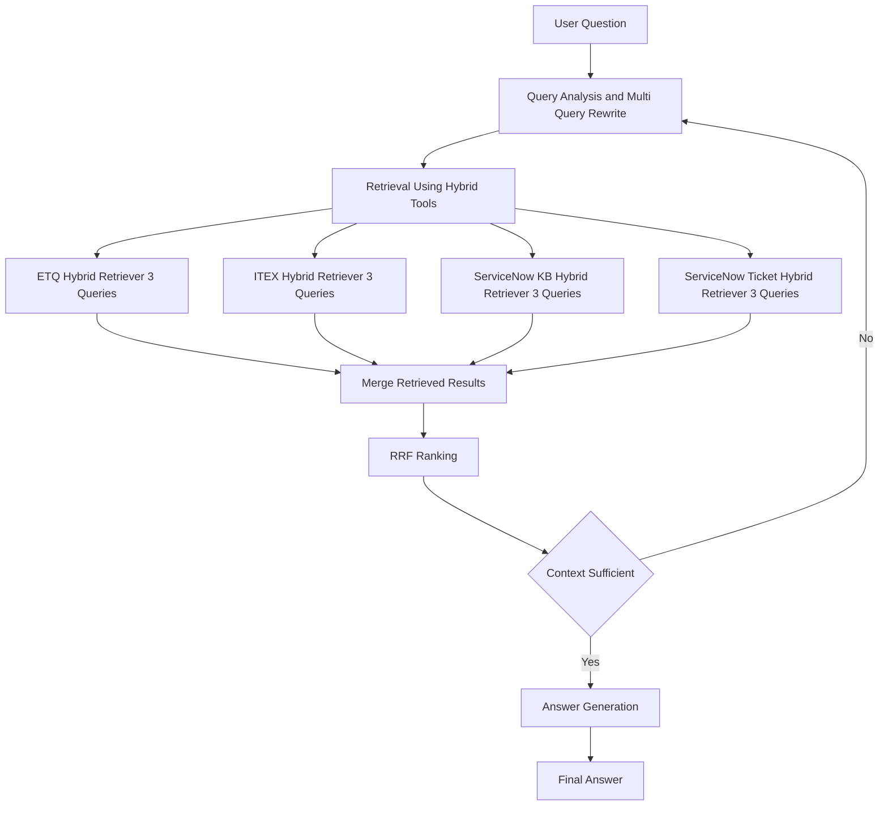

## Production RAG Agent (LangGraph)

This repository contains a production-oriented RAG agent built on LangGraph with:
- Query planning + multi-query rewrite (3 queries per selected source)
- Hybrid retrieval per source (vector + BM25-style FULL_TEXT)
- Deterministic RRF ranking
- Deterministic rule-based context sufficiency check with bounded retries
- Grounded answer generation (LLM uses only ranked context)
- Built-in graph visualization export (Mermaid / optional PNG)

## Architecture

## Configuration

- Copy `.env.example` to `.env` and fill in your values.
- The agent reads configuration from environment variables via `src/rag_agent/config/settings.py`.

## Graph Visualization (No Inference Required)

This writes deterministic artifacts to `artifacts/graphs/`:
- `rag_workflow.mmd` (Mermaid)
- `rag_workflow.md` (Markdown Mermaid block)

PNG export is optional and fails fast if it cannot render.

## Running the Agent

The agent entrypoint is `src/rag_agent/main.py`. A convenience wrapper exists at repo root: `main.py`.

Common usage patterns:
- Export graph: `python main.py --export-graph`
- Export graph (PNG): `python main.py --export-graph-png`
- Run from Python: `from rag_agent.main import run; print(run("your question"))`

## Testing

Minimal smoke tests exist under `tests/` and focus on:
- Settings validation (fail-fast)
- Graph compilation + Mermaid export (no inference required)

Run tests with:
- `python -m unittest -v`
